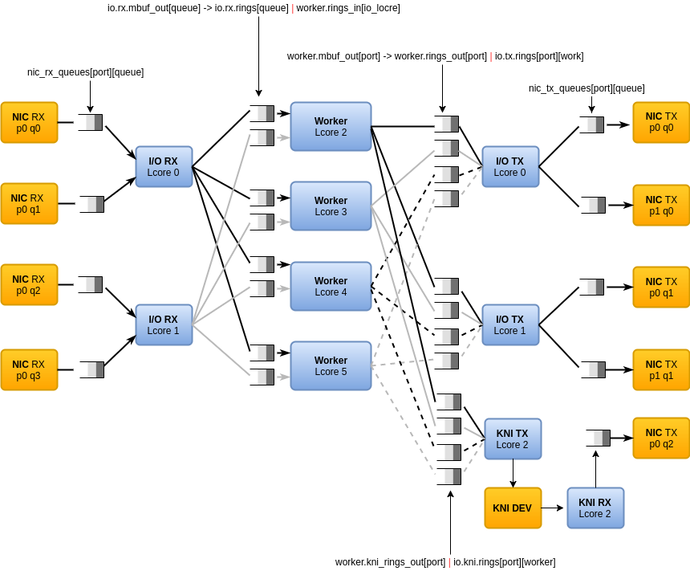

# DPVS (DATA PLANE VIRTUAL SERVER)
	
使用[dpdk][dpdk_org]开发的类[lvs][lvs]负载均衡软件

## FEATURE

* synproxy
* fullnat(tcp/udp)
* persistent
* non-blocking concurrent
* memory pool
* dpdk
  - multicore framework
  - huge page memory
  - ring buffers
  - poll-mode drivers
  - hardware features support(nss hash/checksum offload/vlan offload)
* scheduler use alloc
* support ipvsadm/keepalived



## [benchmark](docs/stress-test/test-result.md)

万兆网卡上，不同大小的数据包吞吐量的理论值与实际值

| PktSize/byte		 |   64  	 |   128	 |   256	 |   512	 |   1024	 |
|----|----|----|----|----|----|
| Theoretical value/Mpps | 14.88	 | 8.45		 | 4.53		 | 2.35		 | 1.20		 |
| Actual value/Mpps	 | 9.38		 | 8.45		 | 4.53		 | 2.35		 | 1.20		 |


## other

* For a first try, you should follow the [quick start](docs/quick_start.md) instructions.
* User guides
  - [dpvs](docs/dpvs.8.md)
  - [govs](https://github.com/dpvs/govs/blob/master/README.md)
  - [ipvsadm](docs/ipvsadm.8.md)
  - [keepalived](docs/keepalived.conf.5.md)
* [programmer's guide](docs/programmer.md)
* [falcon](docs/falcon.md)
* The [list of supported NICs](http://dpdk.org/doc/nics) includes PCI NICs and paravirtualized NICs.
* [benchmark](docs/stress-test/test-result.md)


## 一个例子

```
vs=10.115.57.101:80
rs1=10.115.54.1:80
rs2=10.115.55.1:80
lip1=10.115.42.101
lip2=10.115.42.102

#add virtual service
ipvsadm -A -t $vs -s rr

#edit virtual service
ipvsadm -E -t $vs -s wrr

#add real server
ipvsadm -a -t $vs -r $rs1 -b -w 1
ipvsadm -a -t $vs -r $rs2 -b -w 1

#edit real server
ipvsadm -e -t $vs -r $rs1 -b -w 2

#del real server
ipvsadm -d -t $vs -r $rs1

#add local address
ipvsadm -P -t $vs -z $lip1
ipvsadm -P -t $vs -z $lip2

#del local address
ipvsadm -Q -t $vs -z $lip1

#del virtual service
ipvsadm -D -t $vs

#list lcores information
ipvsadm --info
```

## RESOURCES

* [dpdk.org][dpdk_org] 官网
* [guide][prog_guide]
* [sample][sample]
* source
  - [git://dpdk.org/dpdk](http://dpdk.org/browse/dpdk)
  - [git://dpdk.org/apps/pktgen-dpdk](http://dpdk.org/browse/apps/pktgen-dpdk/)


[dpdk_org]:http://dpdk.org
[prog_guide]:http://dpdk.org/doc/guides/prog_guide
[sample]:http://dpdk.org/doc/guides/sample_app_ug/index.html
[lvs]:http://www.linuxvirtualserver.org/
